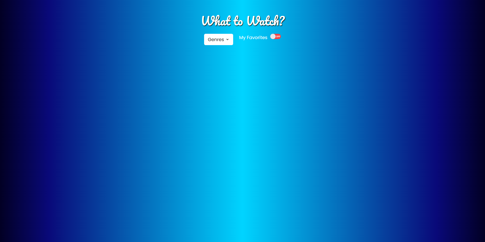
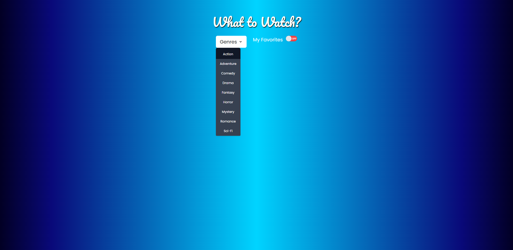
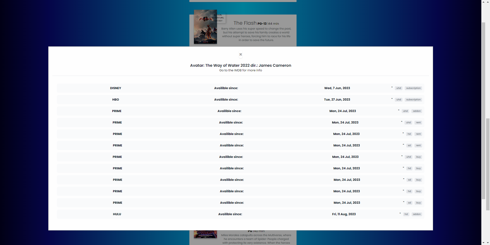
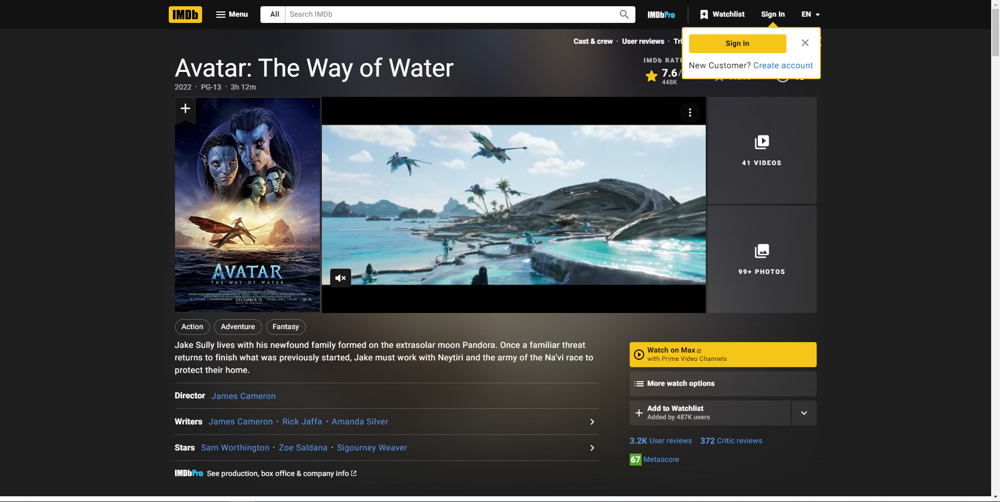
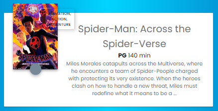
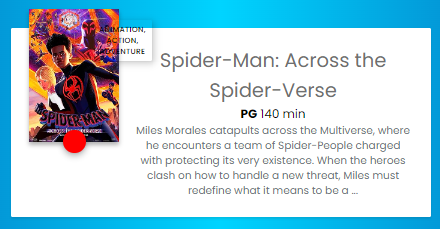
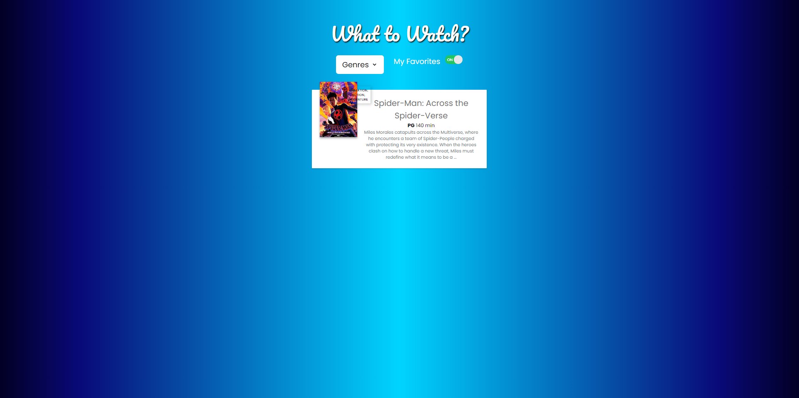

# What to Watch?
## Description

When creating this project, we set out to create a website that allowed visitors to discover new movies in a variety of genres, and where to watch them. By completing this assignment, we gained a better understanding of branch management on GitHub, as well as how to use Tailwind.

## Installation

N/A

## Usage

You can access the single-page app here: https://trlivenp.github.io/What_to_Watch/

When you open this page, you will be presented with a screen that looks like this:

From here, you can use the dropdown menu to select a movie genre of your choosing. This will present the user with a movie list that only features movies that meet that classification. The dropdown menu is demonstrated below:

Another feature of the site is its use of modals. These modals will show you the streaming services where you can watch your movie of choice. Here is an example of one of these modals:

This modals also include a link to the movie's IMDB page, so the user can find out even more information about the film they selected. Here is the IMDB associated with the movie you just saw:

Lastly, the site also features a "My Favorites" toggle bar, that allows you to only display the movies that you deem as your favorite. This is done by simply clicking on the Favorites button. You can see both the button and the "My Favorites" toggle bar in action demonstrated here:

Here is the button turned off (it's base state)

Here is the button turned on (after being clicked)

And here is how the page looks after the "My Favorites" slider is activated.

## Credits

The collaborators on this project were:

Jesse LoCascio

Tristan Livengood

Jonathan Maldonado-Guemarez

The GitHub repo for the project can be found at: https://github.com/trlivenp/What_to_Watch

The Normalize.css (used to do a CSS reset) was downloaded from: https://necolas.github.io/normalize.css/

The .gitignore file was taken from the BootCamp repo located at: https://git.bootcampcontent.com/

Special thanks: 

To the server-side APIs used to retrieve data, helping to create the dynamic elements on display:

Advanced Movie Search API

Online Movie Database API

Streaming Availability API

And finally, to the third party APIs that helped make this project look good:

Tailwind CSS

Google Fonts

## License

MIT License

Please refer to the LICENSE in the repo for more information.

## Features

Movie List

Drop Down Menu

"My Favorites" Toggle Switch

Modals

APIS

External Links